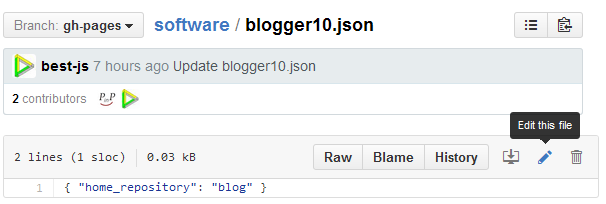

PINP Blog: A Free Blog System with Github-based
===============================================
Product version: 1.0   
Chinese version: [习惯看中文的朋友请点这里](README_zh.md)

&nbsp;

## Introduce

<a target="_blank" href="http://www.pinp.me/www/www/">PINP</a> (*PINP Is Not PPT*) is PPT-like presentation system which is based on HTML5/CSS3.

PINP also supports [Markdown](http://daringfireball.net/projects/markdown/) blog writing, any slide page can embed into blog. So, PINP blog is sample and easy to use that just as *Markdown* looks like, and it enhance blog's representation also, <a target="_blank" href="//best-js.github.io/blog/$$English/1.online_blog.blog/">it is sample</a>.

&nbsp;

## Directory

PINP is mature document system which is released at 2 years ago, it comes with cloud storage service (so called PINP DISK) that supports PINP DOC's online editing and online visiting. Mainly work of this project is: changing storage mechanism from PINP DISK to github public repository.

 >  /source/slide11
 > >  PINP slide, it comes from <a target="_blank" href="//www.pinp.me/www/www/?page=pinp_down.html">PINP Client Tool</a>, we change nothing.

 >  /source/blogger10
 > >  GUI resources for blog that include template, picture, javascript files.

 >  /source/pages
 > >  Provides online editor

&nbsp;

## How it works?

The blog system is depend on the feature of [github pages](https://pages.github.com/), in one word, when you create a public repository in github.com and set `gh-pages` as default branch, you can visit your static WEB files (such as html, css, js, etc) by URL `<username>.github.io/<repository>/index.html`, and it is important, github pages is **free**!

So, when static WEB files are organized as PINP DOC required, they would served as PINP blog and slide documents.

&nbsp;

## Build a free blog system in github

It sounds good, so, how to build one for myself? Please follow next 3 steps:

Step 1: Create github account  
 > Ignore this step if you already have a github account. Goto <a target="_blank" href="https://github.com/">homepage of github</a>, click **Sign up** button and fill personal information as required.

&nbsp;

Step 2: Fork PINP supports repository (i.e. pinp/software)   
 > Open github repository: <a target="_blank" href="https://github.com/pinp/software">pinp/software</a>, then click **Fork** button to clone it to your account. Then, select `software/blogger10.json` file and edit it, set the value of `home_repository` to `blog`, as following diagram.   
   
The value "`blog`" is another repository which will be cloned at next step, it use for denoting which is root blog, then, click **Commit changes** button to apply the modification.

&nbsp;

Step 3: Fork blog repository (i.e. pinp/blog)   
 > Open github repository: <a target="_blank" href="https://github.com/pinp/blog">pinp/blog</a>, click **Fork** button to clone it to your account. Then, select `blog/config.json.json` file and edit it, set the value of `user_name` to your registed username, set the value of `repos_name` to `blog`, as following diagram (suppose username is `best-js`).   
   
Next, click **Commit changes** button to apply the modification.

&nbsp;

Your blog system should be ready by now, please visit it by `https://<username>.github.io/blog/` (you should replace `<username>` to your registed name), the new created blog <a target="target" href="//best-js.github.io/blog/">looks like this</a>.

Blog homepage <a target="_blank" href="https://www.pinp.me/software/pages/blogger/gh_jump.action">can be opened directly</a> when you current reading yourself's `README` file.

&nbsp;

## More information

A set of "Online help" documents will be installed into your blog, include such things:

 - Online help, introduce how to edit blog online, or offline
 - Todo list, progress plan
 - News and activity report

These content will be updated if necessary, you would be notified in your blog homepage when big things happen about this project.

&nbsp;

## License

Copyright 2012-2015, PINP.ME Development Group. All rights reserved.

Redistribution and use in source and binary forms, with or without
modification, are permitted provided that the following conditions
are met:

  - Redistributions of source code must retain the above copyright
    notice, this list of conditions and the following disclaimer.
  - Redistributions in binary form must reproduce the above
    copyright notice, this list of conditions and the following
    disclaimer in the documentation and/or other materials provided
    with the distribution.
  - Neither the name of PINP.ME nor the names of its contributors 
    may be used to endorse or promote products derived from this 
    software without specific prior written permission.

THIS SOFTWARE IS PROVIDED BY THE COPYRIGHT HOLDERS AND CONTRIBUTORS
"AS IS" AND ANY EXPRESS OR IMPLIED WARRANTIES, INCLUDING, BUT NOT
LIMITED TO, THE IMPLIED WARRANTIES OF MERCHANTABILITY AND FITNESS FOR
A PARTICULAR PURPOSE ARE DISCLAIMED. IN NO EVENT SHALL THE COPYRIGHT
OWNER OR CONTRIBUTORS BE LIABLE FOR ANY DIRECT, INDIRECT, INCIDENTAL,
SPECIAL, EXEMPLARY, OR CONSEQUENTIAL DAMAGES (INCLUDING, BUT NOT
LIMITED TO, PROCUREMENT OF SUBSTITUTE GOODS OR SERVICES; LOSS OF USE,
DATA, OR PROFITS; OR BUSINESS INTERRUPTION) HOWEVER CAUSED AND ON ANY
THEORY OF LIABILITY, WHETHER IN CONTRACT, STRICT LIABILITY, OR TORT
(INCLUDING NEGLIGENCE OR OTHERWISE) ARISING IN ANY WAY OUT OF THE USE
OF THIS SOFTWARE, EVEN IF ADVISED OF THE POSSIBILITY OF SUCH DAMAGE.
