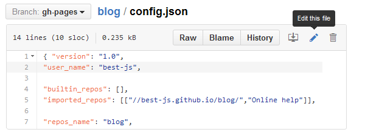

PINP博客：搭建在 github 上的免费博客系统
=======================================
Version 1.0

&nbsp;

## 介绍

PINP 是 *PINP Is Not PPT* 的缩写，中文名为 **拼文**，它是一种借助 HTML5 与 CSS3 技术实现文档系统，支持 Markdown 格式的博客编写，以及类似PPT的演示胶片制作，详情请参考：<a target="_blank" href="//www.pinp.me/www/www/">PINP 网站</a>。

与常规 Markdown 博客相比，PINP博客可将演示胶片嵌入到博客正文中来，由此，既保持 Markdown 简单便捷的特色，又延伸了它的表现力，<a target="_blank" href="//best-js.github.io/blog/$$Chinese中文/1.在线拼文样例.blog/">这里有一个简单样例</a>。

&nbsp;

## 目录与功能

PINP 文档是一个已发布2年的成熟系统，它建立在一个商用网盘系统之上，由网盘提供存贮，支持在线编辑、在线访问。本项目的主要工作是将它的网盘存贮改用 github 公共库实现。

 >  /source/slide11
 > >  PINP 的 slide 软件，支持胶片展示，从 <a target="_blank" href="//www.pinp.me/www/www/?page=pinp_down.html">PINP客户端工具</a> 提取，未作修改。

 >  /source/blogger10
 > >  博客主界面用到资源，包括模板、图片、Javascript文件等保存在这里。

 >  /source/pages
 > >  提供在线编辑器。

&nbsp;

## 实现原理

本系统借助 [github pages](https://pages.github.com/) 实现，概括而言，您在 github 上创建一个 public repository，然后将静态网页文件（`html/css/js`）提交到这个库，并把该库的缺省分支设为 `gh-pages`，之后就能用 `<username>.github.io/<repository>/index.html` 访问网页了。github pages 已提供静态网站托管功能，而且，它是**免费**的！

PINP DOC 采用静态页格式组织博客与演示胶片，只须将静态托管的Web页按 PINP 要求的格式组织起来，就实现了 PINP **博客及胶片** 文档系统。

&nbsp;

## 如何在 github 上创建一个 PINP 博客系统？

看起来不错，那我该如何创建一个属于我自己的免费博客系统呢？请按如下步骤操作，就三步。

第一步：创建 github 帐号。  
 > 进入 <a target="_blank" href="https://github.com/">github首页</a>，点 **Sign up** 按钮，按界面提示进行注册即可。如果您已在 github 注册账号了，请忽略这一步。

&nbsp;

第二步：Fork 博客支持库（即 pinp/software）   
 > 打开 pinp/software 库（<a target="_blank" href="https://github.com/pinp/software">github.com/pinp/software</a>），点右上角的 **Fork** 按钮，将它克隆到你自己的帐号下。成功后，选择该库根目录下的 blogger10.json 文件编辑它，如下图，把 `home_repository` 的值改为 `blog`   
   
这里 `blog` 是我们下一步要 Fork 的库，这一句配置用来指明 PINP 博客的根目录的。接着，我们点 **Commit changes** 提交刚才的修改。

&nbsp;

第三步：Fork 博客库（即 pinp/blog）   
 > 打开 pinp/blog 库（<a target="_blank" href="https://github.com/pinp/blog">github.com/pinp/blog</a>），点右上角的 **Fork** 按钮，将它克隆到你自己的帐号下。成功后，选择该库根目录下的 config.json 文件编辑它，如下图，把 `user_name` 改为您注册的用户名（这里假定用户名为 `best-js`），把 `repos_name` 设为 `blog`   
   
同样点 **Commit changes** 提交所做的修改。

&nbsp;

至此，您的个人博客已创建好，用 `https://<username>.github.io/blog/` 可以访问了（这里 `<username>` 要替换为您注册的用户名）。刚创建的博客看起来像 <a target="target" href="//best-js.github.io/blog/?opendoc=%2F%2Fbest-js.github.io%2Fblog%2F%24%24Chinese%E4%B8%AD%E6%96%87%2F0.%E7%BD%91%E5%BF%97.blog%2F">这个样子</a>。

&nbsp;

## 如何参与

打开博客主页的方法：
 1. <a target="_blank" href="https://www.pinp.me/software/pages/blogger/gh_jump.action">点此链接</a> 打开与当前库相关的博客主页
 2. 或者，手工输入URL：`https://<username>.github.io/blog/`
 3. 或在 github.com 打开克隆后的 `blog` 库主页，那里有打开博客的链接

如果您发现 PINP Blog 问题，或对此有新需求，请在本库提交 issue 或 request。

如果想邀请好友使用本系统，请选点如下按钮：   
 > &nbsp;&nbsp;
   &nbsp;&nbsp;
   &nbsp;&nbsp;
   

&nbsp;

## 进一步信息

经前面步骤创建的博客，缺省已安装 Online help，该在线帮助自身也是按前面步骤创建的个人博客，包含内容有：

 - 在线帮助，介绍如何进行在线编辑、离线编辑，如何做二次开发等
 - 后续工作（Todo List）
 - 活动与进展报告

这些内容是动态更新的，您在 github 正常使用 PINP 博客即可，若有重大更新，您的博客主页会自动获得通知。

&nbsp;

## 版权

Copyright 2012-2015, PINP.ME Development Group. All rights reserved.

Redistribution and use in source and binary forms, with or without
modification, are permitted provided that the following conditions
are met:

  - Redistributions of source code must retain the above copyright
    notice, this list of conditions and the following disclaimer.
  - Redistributions in binary form must reproduce the above
    copyright notice, this list of conditions and the following
    disclaimer in the documentation and/or other materials provided
    with the distribution.
  - Neither the name of PINP.ME nor the names of its contributors 
    may be used to endorse or promote products derived from this 
    software without specific prior written permission.

THIS SOFTWARE IS PROVIDED BY THE COPYRIGHT HOLDERS AND CONTRIBUTORS
"AS IS" AND ANY EXPRESS OR IMPLIED WARRANTIES, INCLUDING, BUT NOT
LIMITED TO, THE IMPLIED WARRANTIES OF MERCHANTABILITY AND FITNESS FOR
A PARTICULAR PURPOSE ARE DISCLAIMED. IN NO EVENT SHALL THE COPYRIGHT
OWNER OR CONTRIBUTORS BE LIABLE FOR ANY DIRECT, INDIRECT, INCIDENTAL,
SPECIAL, EXEMPLARY, OR CONSEQUENTIAL DAMAGES (INCLUDING, BUT NOT
LIMITED TO, PROCUREMENT OF SUBSTITUTE GOODS OR SERVICES; LOSS OF USE,
DATA, OR PROFITS; OR BUSINESS INTERRUPTION) HOWEVER CAUSED AND ON ANY
THEORY OF LIABILITY, WHETHER IN CONTRACT, STRICT LIABILITY, OR TORT
(INCLUDING NEGLIGENCE OR OTHERWISE) ARISING IN ANY WAY OUT OF THE USE
OF THIS SOFTWARE, EVEN IF ADVISED OF THE POSSIBILITY OF SUCH DAMAGE.
